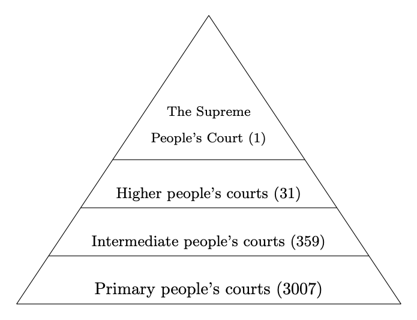

# Data on Chinese court system

### The Four-level court system

- the Supreme People's Court
- higher people's courts at the province level
- intermediate people's courts at the prefecture level
- primary courts at the county/district level

